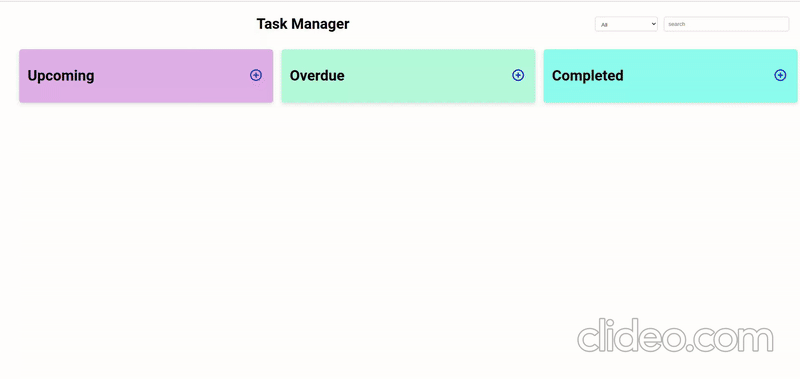

# Task Manager

### Refer to the image below:

 

  

 

### Set Up Instructions

Click to view

- Download dependencies by running `npm install`
- Start up the app using `npm start`

### Features

Click to view

#### Add Tasks: 
- Add new tasks with a title, description, due date, priority (Low, Medium, High), and status (Upcoming, Overdue, Completed).
#### Edit Tasks:
- Modify existing tasks by clicking the ellipsis menu and selecting "Edit".
#### Delete Tasks:
- Delete existing tasks by clicking the ellipsis menu and selecting "Delete".

